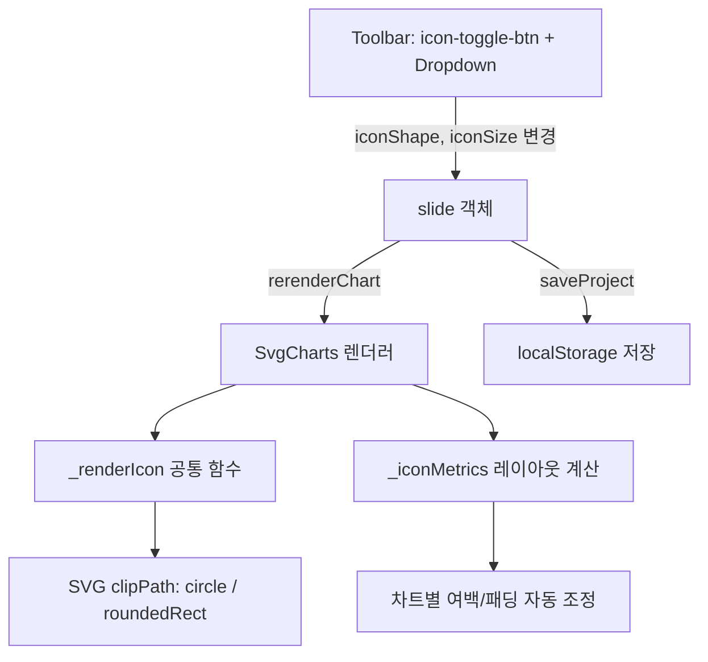
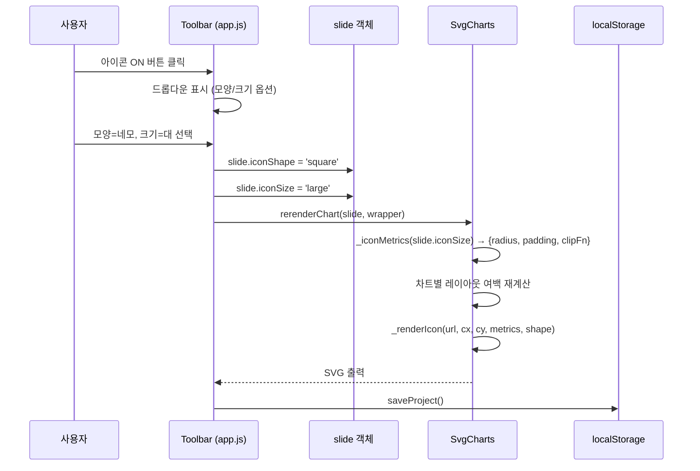

# Design Document: App Icon Customization (앱 아이콘 커스터마이징)

## Overview

차트에서 앱 아이콘의 모양(동그라미/네모)과 크기(소/중/대)를 사용자가 선택할 수 있도록 하는 기능이다. 현재 아이콘은 원형(circle) 클리핑으로 고정 크기(반지름 12~28px)로 렌더링되고 있으며, ON/OFF 토글만 존재한다.

이 기능은 기존 `icon-toggle-btn`을 드롭다운 메뉴로 확장하여 모양/크기 옵션을 제공하고, 선택된 설정에 따라 각 차트 타입(verticalBar, horizontalBar, flowCard, line/combo)의 아이콘 렌더링과 레이아웃 여백을 자동 조정한다. 설정은 장표(slide) 단위로 저장된다.

## Architecture



## Sequence Diagrams

### 아이콘 설정 변경 플로우



## Components and Interfaces

### Component 1: Icon Settings Dropdown (app.js)

**목적**: 기존 `icon-toggle-btn`에 드롭다운 메뉴를 추가하여 모양/크기 선택 UI 제공

**인터페이스**:
```javascript
// slide 객체에 추가되는 속성
slide.iconShape  // 'circle' | 'square', 기본값: 'circle'
slide.iconSize   // 'small' | 'medium' | 'large', 기본값: 'medium'
slide.showAppIcons // boolean (기존)
```

**책임**:
- 아이콘 ON 상태에서 버튼 클릭 시 드롭다운 표시
- 모양/크기 변경 시 slide 객체 업데이트 → rerenderChart 호출
- 아이콘 OFF 시 드롭다운 닫기 + 여백 원복

### Component 2: Icon Rendering Utilities (svgCharts.js)

**목적**: 아이콘 모양/크기에 따른 SVG 렌더링 공통 로직

**인터페이스**:
```javascript
// 크기별 메트릭스 반환
SvgCharts._iconMetrics(sizeKey)
// Returns: { radius: number, padding: number, imgOffset: number }

// 공통 아이콘 SVG 렌더링
SvgCharts._renderIcon(url, cx, cy, metrics, shape, uniqueId)
// Returns: string (SVG markup)
```

**책임**:
- 크기 키('small'/'medium'/'large') → 픽셀 값 변환
- 모양('circle'/'square')에 따른 clipPath 생성
- 스피너 폴백 렌더링

### Component 3: Chart Layout Adjuster (svgCharts.js 각 차트 함수)

**목적**: 아이콘 크기에 따라 차트별 여백/패딩 자동 조정

**책임**:
- verticalBar: X축 하단 여백 = 아이콘 직경 + 패딩
- flowCard: 랭킹 리스트 아이콘 크기 조정
- horizontalBar: 라벨 영역 아이콘 크기 조정
- line/combo: 범례 아이콘 크기 조정

## Data Models

### Icon Configuration

```javascript
// 크기 상수 매핑
const ICON_SIZE_MAP = {
  small:  { radius: 8,  padding: 4,  imgOffset: 1 },  // 16px
  medium: { radius: 12, padding: 6,  imgOffset: 1 },  // 24px
  large:  { radius: 16, padding: 8,  imgOffset: 2 },  // 32px
};

// 모양 타입
// 'circle'  → <clipPath><circle .../></clipPath>
// 'square'  → <clipPath><rect rx="4" .../></clipPath>
```

**유효성 규칙**:
- `iconShape`가 'circle' 또는 'square'가 아니면 'circle'로 폴백
- `iconSize`가 'small', 'medium', 'large'가 아니면 'medium'으로 폴백
- `showAppIcons === false`이면 iconShape/iconSize 무시, 여백 원복


## Key Functions with Formal Specifications

### Function 1: `_iconMetrics(sizeKey)`

```javascript
SvgCharts._iconMetrics = function(sizeKey) {
  const map = {
    small:  { radius: 8,  padding: 4,  imgOffset: 1 },
    medium: { radius: 12, padding: 6,  imgOffset: 1 },
    large:  { radius: 16, padding: 8,  imgOffset: 2 },
  };
  return map[sizeKey] || map.medium;
}
```

**사전조건 (Preconditions)**:
- `sizeKey`는 문자열 (null/undefined 허용 → medium 폴백)

**사후조건 (Postconditions)**:
- 반환값은 `{ radius: number, padding: number, imgOffset: number }` 형태
- `radius > 0`, `padding > 0`, `imgOffset >= 0`
- 유효하지 않은 sizeKey → medium 값 반환

**루프 불변식**: N/A

---

### Function 2: `_renderIcon(url, cx, cy, metrics, shape, uniqueId)`

```javascript
SvgCharts._renderIcon = function(url, cx, cy, metrics, shape, uniqueId) {
  // Returns SVG string: clipPath + background shape + image
}
```

**사전조건 (Preconditions)**:
- `url`은 유효한 이미지 URL 문자열 (빈 문자열이면 스피너 반환)
- `cx`, `cy`는 유한한 숫자 (아이콘 중심 좌표)
- `metrics`는 `_iconMetrics()` 반환값
- `shape`는 'circle' 또는 'square'
- `uniqueId`는 clipPath ID 충돌 방지용 고유 문자열

**사후조건 (Postconditions)**:
- 반환값은 유효한 SVG 마크업 문자열
- `shape === 'circle'` → clipPath 내부에 `<circle>` 사용
- `shape === 'square'` → clipPath 내부에 `<rect rx="4">` 사용
- `url`이 빈 문자열이면 `_iconSpinner()` 결과 반환
- 원본 파라미터에 대한 부수효과 없음

**루프 불변식**: N/A

---

### Function 3: `_chartBottomWithIcons(hasIcons, sizeKey)`

```javascript
SvgCharts._chartBottomWithIcons = function(hasIcons, sizeKey) {
  const base = T.chartBottom();
  if (!hasIcons) return base;
  const m = SvgCharts._iconMetrics(sizeKey);
  return base - (m.radius * 2 + m.padding);
}
```

**사전조건 (Preconditions)**:
- `hasIcons`는 boolean
- `sizeKey`는 유효한 크기 키 또는 null

**사후조건 (Postconditions)**:
- `hasIcons === false` → `T.chartBottom()` 값 그대로 반환
- `hasIcons === true` → 아이콘 직경 + 패딩만큼 차트 하단 영역 축소
- 반환값은 양수

**루프 불변식**: N/A

## Algorithmic Pseudocode

### 아이콘 렌더링 알고리즘

```javascript
function _renderIcon(url, cx, cy, metrics, shape, uniqueId) {
  // ASSERT: metrics는 유효한 _iconMetrics 반환값
  const { radius: r, imgOffset: off } = metrics;
  let svg = '';

  // Step 1: clipPath 정의 (모양에 따라 분기)
  svg += `<defs><clipPath id="${uniqueId}">`;
  if (shape === 'square') {
    const cornerR = Math.max(2, r * 0.25);  // 둥근 모서리 비율
    svg += `<rect x="${cx - r + off}" y="${cy - r + off}" ` +
           `width="${(r - off) * 2}" height="${(r - off) * 2}" rx="${cornerR}"/>`;
  } else {
    // 기본: circle
    svg += `<circle cx="${cx}" cy="${cy}" r="${r - off}"/>`;
  }
  svg += `</clipPath></defs>`;

  // Step 2: 배경 도형
  if (shape === 'square') {
    const cornerR = Math.max(2, r * 0.25);
    svg += `<rect x="${cx - r}" y="${cy - r}" width="${r * 2}" height="${r * 2}" ` +
           `rx="${cornerR}" fill="#FFF" stroke="${T.divider}" stroke-width="0.8"/>`;
  } else {
    svg += `<circle cx="${cx}" cy="${cy}" r="${r}" fill="#FFF" ` +
           `stroke="${T.divider}" stroke-width="0.8"/>`;
  }

  // Step 3: 이미지 또는 스피너
  if (url) {
    svg += `<image href="${url}" x="${cx - r + off}" y="${cy - r + off}" ` +
           `width="${(r - off) * 2}" height="${(r - off) * 2}" ` +
           `clip-path="url(#${uniqueId})" preserveAspectRatio="xMidYMid slice"/>`;
  }

  // ASSERT: svg는 유효한 SVG 마크업
  return svg;
}
```

### verticalBar 레이아웃 조정 알고리즘

```javascript
// verticalBar 함수 내부 아이콘 영역 계산
function calculateVerticalBarIconArea(showIcons, sizeKey) {
  if (!showIcons) return { iconAreaHeight: 0, cBotAdjust: 0 };

  const metrics = _iconMetrics(sizeKey);
  const iconDiameter = metrics.radius * 2;
  const iconAreaHeight = iconDiameter + metrics.padding * 2;

  // 차트 하단을 아이콘 영역만큼 위로 올림
  return {
    iconAreaHeight,
    cBotAdjust: -iconAreaHeight,
    iconY: (cBot) => cBot + 18 + metrics.radius + metrics.padding
    // 라벨(cBot+24) 아래에 패딩 후 아이콘 중심
  };
}
```

## Example Usage

```javascript
// 1. slide 객체에 아이콘 설정 저장
slide.iconShape = 'square';   // 네모
slide.iconSize = 'large';     // 대 (32px)
slide.showAppIcons = true;

// 2. SvgCharts에 설정 전달 (rerenderChart 내부)
SvgCharts._iconShape = slide.iconShape || 'circle';
SvgCharts._iconSize = slide.iconSize || 'medium';
SvgCharts._showAppIcons = slide.showAppIcons !== false;

// 3. verticalBar 내부에서 아이콘 렌더링
const metrics = SvgCharts._iconMetrics(SvgCharts._iconSize);
const shape = SvgCharts._iconShape;
const iconSvg = SvgCharts._renderIcon(
  iconUrl, icX, icY, metrics, shape, `vb-ic-${gi}-${Date.now()}`
);

// 4. 아이콘 OFF 시 여백 원복
slide.showAppIcons = false;
// → SvgCharts._showAppIcons = false
// → _appIcon() returns ''
// → 아이콘 영역 높이 = 0, 차트 하단 여백 원래대로
```

## Correctness Properties

*A property is a characteristic or behavior that should hold true across all valid executions of a system-essentially, a formal statement about what the system should do. Properties serve as the bridge between human-readable specifications and machine-verifiable correctness guarantees.*

### Property 1: 모양-SVG 요소 일관성

*For any* 유효한 iconShape ('circle' 또는 'square')와 임의의 좌표(cx, cy) 및 메트릭스에 대해, `_renderIcon()`의 clipPath 내부 요소는 shape가 'circle'이면 `<circle>`, 'square'이면 `<rect>`를 포함해야 한다.

**Validates: Requirements 3.1, 3.2**

### Property 2: 잘못된 iconSize 폴백

*For any* 'small', 'medium', 'large'가 아닌 임의의 문자열(또는 null/undefined)에 대해, `_iconMetrics()`는 항상 `_iconMetrics('medium')`과 동일한 값을 반환해야 한다.

**Validates: Requirements 2.4, 6.2**

### Property 3: 잘못된 iconShape 폴백

*For any* 'circle', 'square'가 아닌 임의의 문자열에 대해, `_renderIcon()`은 'circle' 모양으로 폴백하여 clipPath 내부에 `<circle>` 요소를 포함해야 한다.

**Validates: Requirements 3.3, 6.1**

### Property 4: OFF 시 차트 여백 복원

*For any* iconSize 값에 대해, `showAppIcons === false`이면 `_chartBottomWithIcons(false, sizeKey)`는 `T.chartBottom()` 원래 값과 동일해야 한다.

**Validates: Requirements 1.3, 4.2**

### Property 5: 레이아웃 높이 불변식

*For any* 유효한 iconSize에 대해, 아이콘이 활성화된 상태에서 차트 데이터 영역 높이와 아이콘 영역 높이의 합은 아이콘이 비활성화된 상태의 전체 가용 높이와 동일해야 한다.

**Validates: Requirement 4.3**

### Property 6: 설정 저장/복원 round-trip

*For any* 유효한 iconShape/iconSize 조합에 대해, Slide 객체에 설정을 저장한 후 localStorage에서 로드하면 동일한 iconShape와 iconSize 값이 복원되어야 한다.

**Validates: Requirements 5.1, 5.2**

### Property 7: 장표 독립성

*For any* N개의 장표와 임의의 장표 인덱스 i에 대해, slide[i]의 iconShape 또는 iconSize를 변경해도 다른 모든 slide[j] (j ≠ i)의 iconShape와 iconSize는 변경 전과 동일해야 한다.

**Validates: Requirement 5.3**

### Property 8: 차트 하단 여백 계산 정확성

*For any* 유효한 sizeKey에 대해, `_chartBottomWithIcons(true, sizeKey)`는 `T.chartBottom() - (metrics.radius * 2 + metrics.padding)`과 정확히 동일해야 한다 (여기서 metrics = `_iconMetrics(sizeKey)`).

**Validates: Requirements 4.1, 4.4**

## Error Handling

### 시나리오 1: 잘못된 iconShape/iconSize 값

**조건**: localStorage에서 로드한 slide 데이터에 유효하지 않은 값이 있을 때
**대응**: `_iconMetrics()`와 `_renderIcon()`에서 기본값으로 폴백 (circle, medium)
**복구**: 다음 저장 시 정규화된 값으로 덮어쓰기

### 시나리오 2: 아이콘 URL 로드 실패

**조건**: `_appIcon()`이 빈 문자열 반환, API 캐시 미스
**대응**: 기존 스피너 폴백 로직 유지 (`_iconSpinner()`)
**복구**: `preloadAppIcons()` 완료 후 rerenderChart 호출

### 시나리오 3: 드롭다운 외부 클릭

**조건**: 드롭다운이 열린 상태에서 외부 영역 클릭
**대응**: 드롭다운 닫기 (document click 이벤트 리스너)
**복구**: 현재 설정 유지

## Testing Strategy

### Unit Testing

- `_iconMetrics()`: 각 sizeKey에 대한 반환값 검증, 잘못된 키 폴백 검증
- `_renderIcon()`: circle/square 모양별 SVG 출력 검증, 빈 URL 시 스피너 검증
- 레이아웃 계산: 아이콘 크기별 차트 하단 여백 값 검증

### Property-Based Testing

**라이브러리**: fast-check

- ∀ sizeKey ∈ {'small','medium','large'}: `_iconMetrics(sizeKey).radius * 2` ∈ {16, 24, 32}
- ∀ shape, size 조합: `_renderIcon()` 출력에 유효한 clipPath ID 포함
- ∀ slide 설정 변경: rerenderChart 후 SVG 내 아이콘 요소 수 = 예상 라벨 수

### Integration Testing

- 드롭다운 UI 조작 → slide 객체 업데이트 → SVG 재렌더링 → 아이콘 모양/크기 반영 확인
- 아이콘 OFF → ON → 설정 변경 → OFF 사이클에서 여백 정상 복원 확인
- 프로젝트 저장/로드 후 아이콘 설정 유지 확인

## Performance Considerations

- `_renderIcon()`은 순수 문자열 연결이므로 성능 영향 미미
- 기존 `_appIcon()` 캐시 로직 그대로 활용 → 추가 네트워크 요청 없음
- 드롭다운 DOM은 버튼 클릭 시에만 생성/토글 → 불필요한 리렌더링 방지

## Security Considerations

- 아이콘 URL은 기존 `_appIcon()` 검증 로직 유지 (http/https/data:image/icons/ 패턴만 허용)
- iconShape/iconSize 값은 화이트리스트 검증 후 사용

## Dependencies

- 기존 의존성만 사용 (추가 라이브러리 없음)
- `svgCharts.js`: 아이콘 렌더링 + 레이아웃 조정
- `app.js`: 툴바 드롭다운 UI + slide 객체 관리
- `style.css`: 드롭다운 스타일
- `chartTheme.js`: 디자인 토큰 (T 객체)
