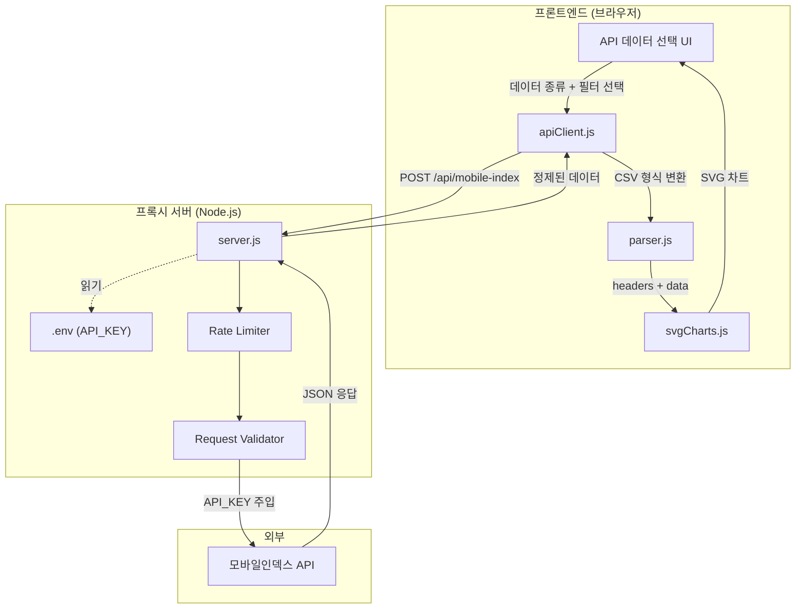
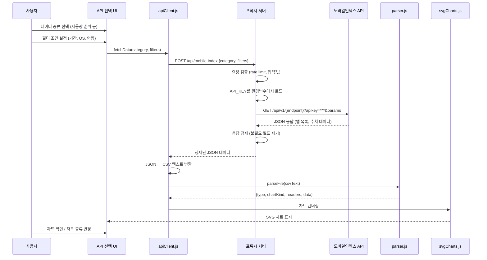
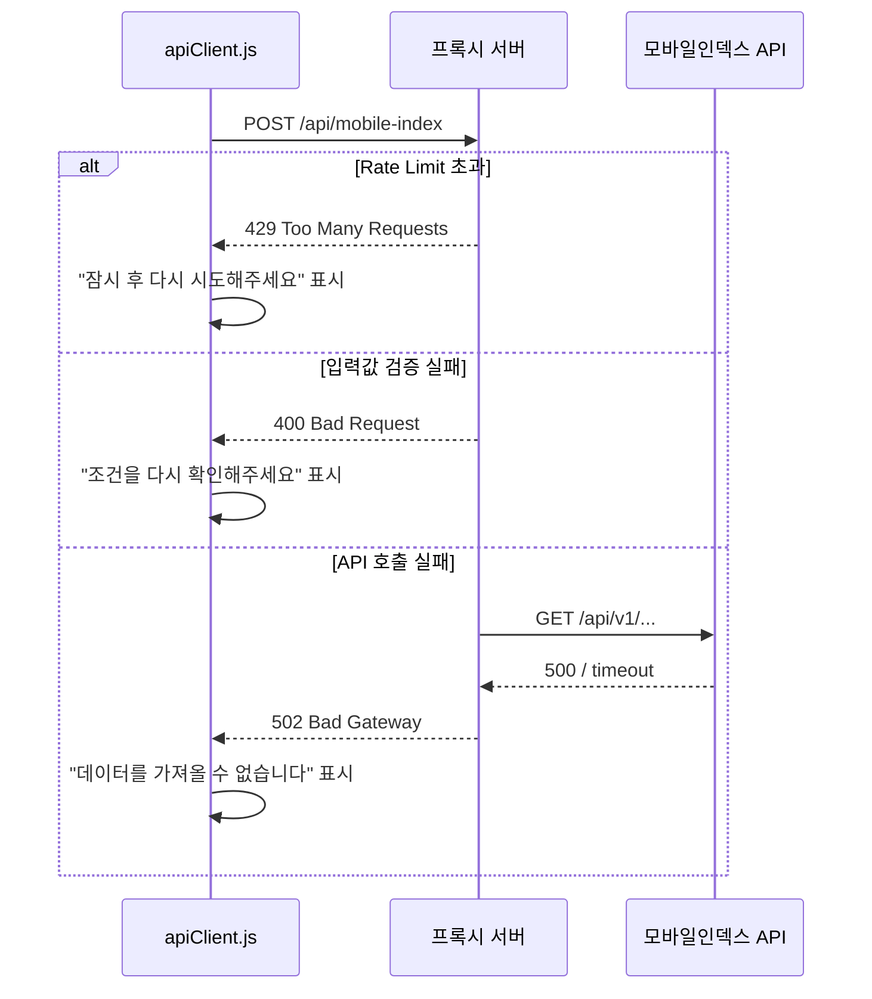

# Design Document: Secure API Integration (모바일인덱스 API 보안 연동)

## Overview

모바일인덱스(Mobile Index) 데이터 API를 기존 Chart Studio 앱에 안전하게 연동하는 기능이다. 현재 CSV/XLSX 파일 업로드 방식만 지원하는 앱에 API 기반 데이터 조회 경로를 추가한다.

핵심 보안 요구사항은 API 키가 프론트엔드에 절대 노출되지 않도록 하는 것이다. 이를 위해 경량 프록시 서버를 도입하여 API 키를 서버 측 환경변수에만 보관하고, 프론트엔드는 프록시 서버에만 요청을 보낸다. 프론트엔드에서 사용자가 데이터 종류(사용량 순위, 트래픽 분석, 데모그래픽 등)와 필터 조건(기간, OS, 연령, 성별)을 선택하면, 프록시 서버가 모바일인덱스 API를 호출하고 결과를 반환하며, 기존 Parser → SvgCharts 파이프라인을 통해 자동으로 차트가 생성된다.

## Architecture



## Sequence Diagrams

### 메인 플로우: API 데이터 조회 → 차트 생성



### 에러 처리 플로우



## Components and Interfaces

### Component 1: API 데이터 선택 UI (index.html 확장)

**Purpose**: 사용자가 모바일인덱스 API에서 조회할 데이터 종류와 필터 조건을 선택하는 UI

**Interface**:
```javascript
// 온보딩 화면에 추가되는 UI 요소
// "파일 업로드" 옆에 "API 데이터 조회" 탭 추가

// 데이터 카테고리 선택
const API_CATEGORIES = {
  ranking_users:       '사용량 순위 > 사용자 수',
  ranking_time:        '사용량 순위 > 총 사용시간',
  ranking_avg_time:    '사용량 순위 > 1인당 평균 사용시간',
  ranking_installs:    '사용량 순위 > 신규 설치 건',
  traffic_users:       '업종 트래픽 > 사용자 수',
  traffic_time:        '업종 트래픽 > 사용시간',
  demo_compare:        '데모그래픽 비교 > 사용자 구성',
  compare_users:       '기본 비교 > 사용자 수',
  compare_time:        '기본 비교 > 총 사용시간'
};

// 필터 조건
/** @typedef {Object} ApiFilters
 *  @property {string} startDate   - 시작 기간 (YYYY-MM)
 *  @property {string} endDate     - 종료 기간 (YYYY-MM)
 *  @property {'android'|'ios'|'all'} os - OS 필터
 *  @property {'all'|'male'|'female'} gender - 성별
 *  @property {string} ageRange    - 연령대 ('all','10','20','30','40','50')
 *  @property {string} industry    - 업종 대분류
 *  @property {string[]} appIds    - 비교 분석 시 앱 패키지명 목록
 */
```

**Responsibilities**:
- 데이터 카테고리 드롭다운 렌더링
- 필터 조건 폼 렌더링 (기간, OS, 성별, 연령)
- 선택 완료 시 apiClient.fetchData() 호출
- 로딩 상태 및 에러 메시지 표시

### Component 2: API 클라이언트 (apiClient.js)

**Purpose**: 프록시 서버와 통신하고, 응답 데이터를 기존 Parser 형식으로 변환

**Interface**:
```javascript
const ApiClient = {
  /** 프록시 서버 기본 URL */
  BASE_URL: '/api',

  /**
   * 모바일인덱스 데이터 조회
   * @param {string} category - API_CATEGORIES 키
   * @param {ApiFilters} filters - 필터 조건
   * @returns {Promise<{type: string, chartKind: string, meta: Object, headers: string[], data: string[][]}>}
   */
  async fetchData(category, filters) { /* ... */ },

  /**
   * API JSON 응답 → Parser 호환 형식 변환
   * @param {string} category - 데이터 카테고리
   * @param {Object} rawJson - API 원본 응답
   * @returns {{type: string, chartKind: string, meta: Object, headers: string[], data: string[][]}}
   */
  transformResponse(category, rawJson) { /* ... */ },

  /**
   * 사용 가능한 업종 목록 조회
   * @returns {Promise<{code: string, name: string}[]>}
   */
  async getIndustries() { /* ... */ }
};
```

**Responsibilities**:
- 프록시 서버에 POST 요청 전송
- JSON 응답을 Parser 호환 형식(headers + data 2D 배열)으로 변환
- 에러 핸들링 및 사용자 친화적 에러 메시지 생성
- 요청 취소(AbortController) 지원

### Component 3: 프록시 서버 (server.js)

**Purpose**: API 키를 안전하게 보관하고, 프론트엔드 요청을 모바일인덱스 API로 중계

**Interface**:
```javascript
// Express 기반 경량 프록시 서버

/**
 * POST /api/mobile-index
 * Body: { category: string, filters: ApiFilters }
 * Response: { success: boolean, data: Object }
 */

/**
 * GET /api/industries
 * Response: { success: boolean, data: {code: string, name: string}[] }
 */

// 서버 설정
const SERVER_CONFIG = {
  port: 3000,
  rateLimit: {
    windowMs: 60 * 1000,  // 1분
    maxRequests: 30        // 분당 최대 30회
  },
  allowedOrigins: ['http://localhost:3000'],
  apiKeyEnvVar: 'MOBILE_INDEX_API_KEY'
};
```

**Responsibilities**:
- `.env` 파일에서 API 키 로드 (dotenv)
- 요청 입력값 검증 (허용된 카테고리, 필터 범위)
- Rate limiting 적용
- CORS 설정 (허용된 origin만)
- 모바일인덱스 API 호출 및 응답 중계
- 에러 로깅 (API 키는 로그에 절대 포함하지 않음)

## Data Models

### Model 1: API 요청 (프론트엔드 → 프록시)

```javascript
/**
 * @typedef {Object} ApiRequest
 * @property {string} category - 데이터 카테고리 키
 * @property {ApiFilters} filters - 필터 조건 객체
 */

// 예시
const request = {
  category: 'ranking_users',
  filters: {
    startDate: '2026-03',
    endDate: '2026-03',
    os: 'all',
    gender: 'all',
    ageRange: 'all',
    industry: '패션/의류',
    appIds: []
  }
};
```

**Validation Rules**:
- `category`는 허용된 카테고리 목록에 포함되어야 함
- `startDate`, `endDate`는 YYYY-MM 형식이며 endDate >= startDate
- `os`는 'android', 'ios', 'all' 중 하나
- `gender`는 'all', 'male', 'female' 중 하나
- `ageRange`는 'all', '10', '20', '30', '40', '50' 중 하나
- `appIds`는 비교 분석 카테고리에서만 필수 (최대 5개)

### Model 2: 정제된 API 응답 (프록시 → 프론트엔드)

```javascript
/**
 * @typedef {Object} ApiResponse
 * @property {boolean} success
 * @property {Object} data
 * @property {string} data.reportType - 리포트 유형 문자열
 * @property {string} data.filterInfo - 필터 정보 문자열
 * @property {string[]} data.headers - 컬럼 헤더 배열
 * @property {string[][]} data.rows - 데이터 행 2D 배열
 * @property {string} [error] - 에러 시 메시지
 */

// 성공 응답 예시
const response = {
  success: true,
  data: {
    reportType: '업종 사용량 순위>사용자 수 순위',
    filterInfo: '(OS:Android+iOS / 기간:월간 / 기간상세:2026-03 / 업종 대분류:패션/의류)',
    headers: ['순위', '앱명', '사용자 수', '점유율', 'Android 비율', 'iOS 비율'],
    rows: [
      ['1', '무신사', '6164443', '33.91', '54.3', '45.7'],
      ['2', '에이블리', '6020531', '33.12', '53.5', '46.5']
    ]
  }
};
```

### Model 3: 에러 응답

```javascript
const errorResponse = {
  success: false,
  error: '데이터를 가져올 수 없습니다',
  code: 'API_ERROR'  // 'RATE_LIMIT', 'VALIDATION_ERROR', 'API_ERROR', 'TIMEOUT'
};
```


## Key Functions with Formal Specifications

### Function 1: ApiClient.fetchData()

```javascript
async function fetchData(category, filters) {
  // POST /api/mobile-index → 정제된 데이터 반환
}
```

**Preconditions:**
- `category`는 `API_CATEGORIES`에 정의된 유효한 키
- `filters`는 null이 아니며 `startDate`, `endDate` 필드 포함
- 네트워크 연결 가능 상태

**Postconditions:**
- 성공 시: Parser 호환 객체 반환 `{type, chartKind, meta, headers, data}`
- `headers`는 길이 2 이상의 문자열 배열
- `data`는 각 행이 `headers.length`와 동일한 길이의 2D 배열
- 실패 시: 사용자 친화적 에러 메시지를 포함한 Error throw
- API 키는 반환 객체에 절대 포함되지 않음

**Loop Invariants:** N/A

### Function 2: ApiClient.transformResponse()

```javascript
function transformResponse(category, rawJson) {
  // API JSON → {type, chartKind, meta, headers, data} 변환
}
```

**Preconditions:**
- `category`는 유효한 카테고리 키
- `rawJson`은 null이 아닌 객체이며 모바일인덱스 API 응답 스키마를 따름

**Postconditions:**
- 반환 객체의 `type`은 Parser.js의 타입 체계와 호환
- `chartKind`는 `T.KINDS`에 정의된 유효한 차트 종류
- `headers[0]`은 레이블 열 (앱명, 순위 등)
- `data`의 모든 행은 `headers`와 동일한 길이
- 숫자 값의 쉼표는 제거된 상태

**Loop Invariants:**
- 변환 루프에서 각 반복 후 처리된 행은 headers 길이와 일치

### Function 3: 프록시 서버 요청 핸들러

```javascript
async function handleApiRequest(req, res) {
  // 입력 검증 → API 키 주입 → 모바일인덱스 호출 → 응답 정제
}
```

**Preconditions:**
- `MOBILE_INDEX_API_KEY` 환경변수가 설정되어 있음
- `req.body`에 `category`와 `filters` 필드 존재
- Rate limit 미초과 상태

**Postconditions:**
- 성공: 200 + 정제된 데이터 (API 키 미포함)
- 검증 실패: 400 + 에러 메시지
- Rate limit: 429 + 재시도 안내
- API 오류: 502 + 일반적 에러 메시지 (내부 상세 미노출)
- 응답 헤더에 적절한 CORS, Content-Type 설정

**Loop Invariants:** N/A

### Function 4: validateRequest()

```javascript
function validateRequest(body) {
  // 요청 본문의 category, filters 유효성 검증
  // returns: { valid: boolean, error?: string }
}
```

**Preconditions:**
- `body`는 파싱된 JSON 객체 (null 가능)

**Postconditions:**
- `valid === true`이면 `category`는 허용 목록에 포함, `filters`의 모든 필드가 허용 범위 내
- `valid === false`이면 `error`에 구체적 검증 실패 사유 포함
- SQL injection, XSS 등 악의적 입력 차단
- 입력값은 변경되지 않음 (순수 함수)

**Loop Invariants:** N/A

## Algorithmic Pseudocode

### 메인 데이터 조회 알고리즘

```javascript
// ALGORITHM: fetchAndRenderChart
// INPUT: category (string), filters (ApiFilters)
// OUTPUT: 차트가 렌더링된 슬라이드

async function fetchAndRenderChart(category, filters) {
  // Step 1: 입력 검증
  if (!API_CATEGORIES[category]) throw new Error('유효하지 않은 카테고리');
  if (!filters.startDate || !filters.endDate) throw new Error('기간을 선택해주세요');

  // Step 2: 로딩 UI 표시
  showLoading(true);

  try {
    // Step 3: 프록시 서버에 데이터 요청
    const response = await fetch('/api/mobile-index', {
      method: 'POST',
      headers: { 'Content-Type': 'application/json' },
      body: JSON.stringify({ category, filters })
    });

    if (!response.ok) {
      const err = await response.json();
      throw new Error(err.error || '데이터 조회 실패');
    }

    const { data } = await response.json();

    // Step 4: 응답 → Parser 호환 형식 변환
    const parsed = ApiClient.transformResponse(category, data);
    // ASSERT: parsed.headers.length >= 2
    // ASSERT: parsed.data.every(row => row.length === parsed.headers.length)

    // Step 5: 기존 차트 렌더링 파이프라인에 주입
    // 기존 app.js의 슬라이드 추가 로직 재사용
    addSlideFromParsedData(parsed);

  } finally {
    showLoading(false);
  }
}
```

### 프록시 서버 요청 처리 알고리즘

```javascript
// ALGORITHM: proxyRequestHandler
// INPUT: HTTP POST request with {category, filters}
// OUTPUT: 정제된 모바일인덱스 API 응답

async function proxyRequestHandler(req, res) {
  // Step 1: Rate limit 확인
  if (isRateLimited(req.ip)) {
    return res.status(429).json({ success: false, error: '요청이 너무 많습니다', code: 'RATE_LIMIT' });
  }

  // Step 2: 입력 검증
  const validation = validateRequest(req.body);
  if (!validation.valid) {
    return res.status(400).json({ success: false, error: validation.error, code: 'VALIDATION_ERROR' });
  }

  const { category, filters } = req.body;

  // Step 3: 카테고리 → 모바일인덱스 API 엔드포인트 매핑
  const endpoint = CATEGORY_TO_ENDPOINT[category];
  const queryParams = buildQueryParams(filters);

  // Step 4: API 키 주입 및 외부 API 호출
  // CRITICAL: API 키는 서버 측에서만 주입
  const apiKey = process.env.MOBILE_INDEX_API_KEY;
  // ASSERT: apiKey !== undefined && apiKey.length > 0

  const apiUrl = `https://api.mobileindex.com/v1/${endpoint}?apikey=${apiKey}&${queryParams}`;

  try {
    const apiResponse = await fetch(apiUrl, { timeout: 10000 });
    const rawData = await apiResponse.json();

    // Step 5: 응답 정제 (민감 정보 제거)
    const sanitized = sanitizeResponse(rawData);
    // ASSERT: JSON.stringify(sanitized)에 apiKey 미포함

    return res.json({ success: true, data: sanitized });

  } catch (error) {
    // API 내부 오류 상세는 클라이언트에 노출하지 않음
    console.error('[API Error]', error.message); // 키는 로그에 미포함
    return res.status(502).json({ success: false, error: '외부 API 연결 실패', code: 'API_ERROR' });
  }
}
```

### 응답 변환 알고리즘

```javascript
// ALGORITHM: transformResponse
// INPUT: category (string), rawJson (API 응답 객체)
// OUTPUT: Parser 호환 객체 {type, chartKind, meta, headers, data}

function transformResponse(category, rawJson) {
  const { reportType, filterInfo, headers, rows } = rawJson;

  // Step 1: 카테고리 → Parser 타입 매핑
  const type = CATEGORY_TO_PARSER_TYPE[category] || 'unknown';

  // Step 2: 차트 종류 자동 추천 (기존 Parser 로직 재사용)
  const chartKind = Parser.recommendChart(type, headers, rows);

  // Step 3: 숫자 쉼표 제거
  Parser._cleanNumericCommas(headers, rows);

  // Step 4: 패키지명 → 앱명 변환
  Parser._convertPkgToAppName(headers, rows);

  // ASSERT: headers.length >= 2
  // ASSERT: rows.every(r => r.length === headers.length)

  return {
    type,
    chartKind,
    meta: { reportType, filterInfo, appName: '' },
    headers,
    data: rows
  };
}
```

## Example Usage

```javascript
// 예시 1: 패션 업종 사용자 수 순위 조회
const result = await ApiClient.fetchData('ranking_users', {
  startDate: '2026-03',
  endDate: '2026-03',
  os: 'all',
  gender: 'all',
  ageRange: 'all',
  industry: '패션/의류',
  appIds: []
});
// result = { type: 'ranking_users', chartKind: 'horizontalBar', headers: [...], data: [...] }

// 예시 2: 앱 비교 분석 (사용자 수 추이)
const comparison = await ApiClient.fetchData('compare_users', {
  startDate: '2025-10',
  endDate: '2026-03',
  os: 'all',
  gender: 'all',
  ageRange: 'all',
  industry: '',
  appIds: ['com.musinsa.store', 'com.banhala.android', 'com.croquis.zigzag']
});
// comparison = { type: 'compare_users', chartKind: 'line', headers: [...], data: [...] }

// 예시 3: 에러 처리
try {
  await ApiClient.fetchData('ranking_users', { startDate: '2026-03', endDate: '2026-03' });
} catch (err) {
  // err.message = '데이터를 가져올 수 없습니다'
  showErrorToast(err.message);
}
```

## Correctness Properties

1. **API 키 비노출 (P1)**: ∀ response ∈ 프론트엔드_수신_데이터: `JSON.stringify(response)`에 API 키 문자열이 포함되지 않음
2. **API 키 비노출 (P2)**: ∀ htmlElement ∈ DOM: `element.textContent` 및 `element.getAttribute(*)` 에 API 키 미포함
3. **데이터 무결성 (P3)**: ∀ parsed ∈ 변환_결과: `parsed.data.every(row => row.length === parsed.headers.length)`
4. **차트 호환성 (P4)**: ∀ parsed ∈ 변환_결과: `parsed.chartKind ∈ Object.keys(T.KINDS)`
5. **입력 검증 (P5)**: ∀ request ∈ 프록시_수신_요청: `validateRequest(request.body).valid === false` → 모바일인덱스 API 호출 없음
6. **Rate Limit (P6)**: ∀ ip, window(60s): 해당 IP의 요청 수 ≤ 30
7. **에러 격리 (P7)**: ∀ error ∈ 프록시_에러_응답: 응답 본문에 스택 트레이스, 내부 URL, API 키 미포함

## Error Handling

### Error Scenario 1: API 키 미설정

**Condition**: 서버 시작 시 `MOBILE_INDEX_API_KEY` 환경변수가 없음
**Response**: 서버 시작 실패 + 콘솔에 명확한 설정 안내 메시지 출력
**Recovery**: `.env` 파일에 키 추가 후 서버 재시작

### Error Scenario 2: Rate Limit 초과

**Condition**: 동일 IP에서 1분 내 30회 초과 요청
**Response**: 429 상태 코드 + "잠시 후 다시 시도해주세요" 메시지
**Recovery**: 프론트엔드에서 재시도 버튼 표시, 자동 재시도는 하지 않음

### Error Scenario 3: 모바일인덱스 API 장애

**Condition**: 외부 API가 5xx 응답 또는 10초 타임아웃
**Response**: 502 상태 코드 + "외부 API 연결 실패" 메시지
**Recovery**: 프론트엔드에서 "다시 시도" 버튼 표시, 사용자에게 파일 업로드 대안 안내

### Error Scenario 4: 잘못된 필터 조건

**Condition**: 허용되지 않은 카테고리, 잘못된 날짜 형식 등
**Response**: 400 상태 코드 + 구체적 검증 실패 사유
**Recovery**: 프론트엔드에서 해당 필드 하이라이트 + 올바른 형식 안내

## Testing Strategy

### Unit Testing Approach

- `validateRequest()`: 유효/무효 입력 조합 테스트
- `transformResponse()`: 각 카테고리별 변환 정확성 테스트
- `ApiClient.fetchData()`: mock fetch를 이용한 성공/실패 시나리오 테스트
- Rate limiter: 시간 기반 요청 카운트 테스트

### Property-Based Testing Approach

**Property Test Library**: fast-check

- P1/P2: 임의의 API 키 문자열에 대해 응답에 키가 포함되지 않음을 검증
- P3: 임의의 유효 JSON 응답에 대해 변환 결과의 행 길이 일관성 검증
- P5: 임의의 입력에 대해 검증 실패 시 API 호출이 발생하지 않음 검증

### Integration Testing Approach

- 프론트엔드 → 프록시 → mock 모바일인덱스 API 전체 플로우 테스트
- CSP(Content Security Policy) 헤더가 외부 API 직접 호출을 차단하는지 확인
- 브라우저 DevTools Network 탭에서 API 키 미노출 확인

## Security Considerations

### API 키 보호 계층

1. **서버 측 환경변수**: API 키는 `.env` 파일에만 저장, `.gitignore`에 `.env` 추가
2. **프록시 패턴**: 프론트엔드는 프록시 서버에만 요청, 모바일인덱스 API URL 자체를 모름
3. **CSP 강화**: `connect-src`에 프록시 서버만 허용, 외부 API 도메인 차단
4. **응답 정제**: 프록시가 응답에서 API 키 관련 필드를 제거 후 전달
5. **로그 보안**: 에러 로그에 API 키 미포함, 요청 URL 로깅 시 키 마스킹

### 입력 검증

- 허용 목록(allowlist) 기반 카테고리 검증
- 날짜 형식 정규식 검증
- 문자열 길이 제한
- JSON body 크기 제한 (10KB)

### 전송 보안

- 프록시 서버 HTTPS 적용 (프로덕션)
- CORS origin 제한
- Rate limiting으로 남용 방지

## Performance Considerations

- 프록시 서버는 Express 기반 경량 서버로 오버헤드 최소화
- 모바일인덱스 API 응답 캐싱 고려 (동일 조건 반복 조회 시, 선택적)
- 프론트엔드에서 AbortController로 중복 요청 취소
- 차트 렌더링은 기존 SVG 파이프라인 재사용 (추가 라이브러리 불필요)

## Dependencies

- **express**: 프록시 서버 프레임워크
- **dotenv**: 환경변수 로드 (.env → process.env)
- **express-rate-limit**: Rate limiting 미들웨어
- **cors**: CORS 미들웨어
- **node-fetch** 또는 내장 fetch (Node 18+): 모바일인덱스 API 호출
- 프론트엔드 추가 의존성 없음 (순수 JS 유지)
